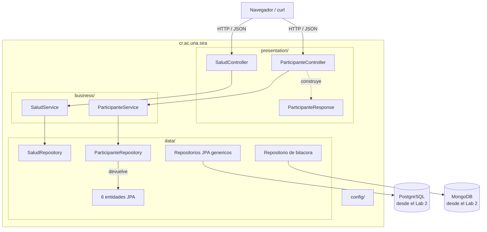
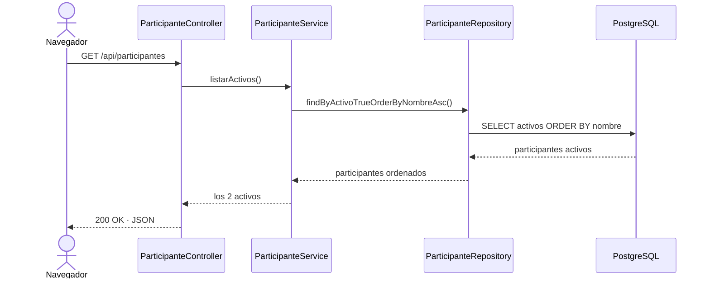

# Arquitectura de SIRA

El sistema está organizado en tres capas sobre Spring Boot 3. El porqué de esta organización está en el [ADR-001](adr/ADR-001-arquitectura-en-capas.md).

## Las capas



Las flechas representan dependencias reales del Laboratorio 3.

| Capa | Paquete | Responsabilidad |
|------|---------|-----------------|
| Presentación | `presentation/` | Recibir HTTP y devolver JSON. Sin reglas de negocio. |
| Negocio | `business/` | Reglas, validaciones, cálculos y límites de transacción. |
| Datos | `data/` | Leer y guardar en la fuente de datos. |
| Configuración | `config/` | Beans de Spring. No es una capa del flujo, es transversal. |

## La regla de las dependencias

```
presentation  ->  business  ->  data
```

En una sola dirección. Un controlador puede llamar a un servicio, pero un servicio nunca debe saber que existe HTTP. Se puede comprobar buscando los imports: en `data/` no aparece nada de `business` ni de `presentation`, en `business/` no aparece nada de `presentation`, y `org.springframework.web` no aparece fuera de `presentation/`.

## Cómo interactúan

`GET /api/participantes`:



El servicio expresa el caso de uso y el repositorio hace el filtrado y ordenamiento
en PostgreSQL, evitando cargar filas que la API no necesita.

## Estructura

```
src/main/java/cr/ac/una/sira/
├── SiraApplication.java
├── presentation/   SaludController, ParticipanteController, ParticipanteResponse
├── business/       SaludService, ParticipanteService
├── data/           Entidades JPA, documento Mongo, repositorios y Specifications
└── config/         Configuración transversal

src/test/java/cr/ac/una/sira/
├── SiraApplicationTests.java
├── business/ParticipanteServiceTest.java
└── data/PersistenciaIntegracionTest.java
```

La evidencia de JPQL, Criteria y del problema N+1 esta en
[`lab3-persistencia-orm.md`](lab3-persistencia-orm.md).
