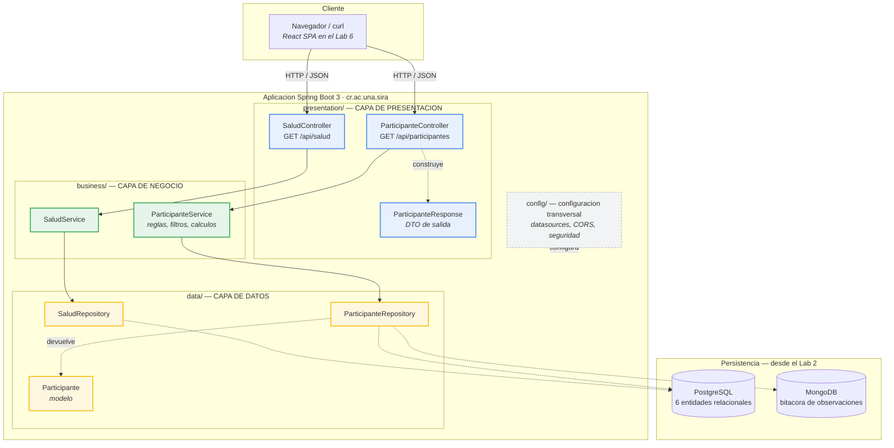
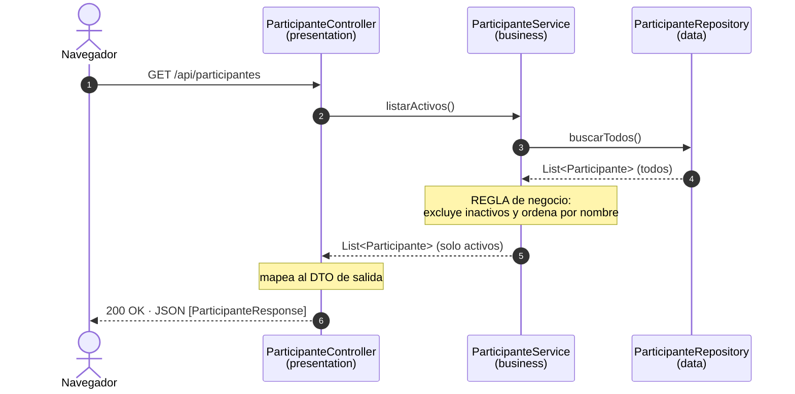

# Arquitectura de SIRA · Laboratorio 1

Sistema de Rutinas y Apoyos — arquitectura **por capas** sobre Spring Boot 3.

---

## 1 · Las capas y su interacción



Las flechas **continuas** son dependencias reales en el código (un tipo importa a otro).
Las **punteadas** son relaciones de datos o infraestructura que todavía no existen en el Lab 1.

---

## 2 · La regla de oro de las dependencias

```
presentation  ───►  business  ───►  data
```

**En una sola dirección, nunca al revés.** Cada capa conoce únicamente a la que tiene debajo:

- Un controlador puede llamar a un servicio.
- Un servicio **jamás** debe saber que existe una pantalla, una petición HTTP o un navegador.
- Un repositorio no conoce ni al servicio ni al controlador.

Cómo se verifica esto en el código entregado: si se buscan los `import` de cada paquete, en
`data/` no aparece ningún `cr.ac.una.sira.business` ni `cr.ac.una.sira.presentation`, y en
`business/` no aparece ningún `cr.ac.una.sira.presentation`. Tampoco hay ningún `jakarta.servlet`
ni ningún `org.springframework.web` fuera de `presentation/`.

---

## 3 · Qué hace cada capa

| Capa | Paquete | Responsabilidad | Qué NO le corresponde |
|---|---|---|---|
| **Presentación** | `presentation/` | Recibir HTTP, validar el formato de la petición, serializar la respuesta JSON | Reglas de negocio, cálculos, acceso a datos |
| **Negocio** | `business/` | Reglas, validaciones, cálculos, orquestación de transacciones | Saber que existe HTTP; saber si los datos vienen de SQL o de memoria |
| **Datos** | `data/` | Leer y escribir en la fuente de datos; modelo persistente | Decidir *qué* datos son válidos o cómo se calculan |
| **Configuración** | `config/` | Beans de Spring, datasources, CORS, seguridad | No es una capa del flujo: es transversal |

---

## 4 · Recorrido de una petición

Ejemplo real, `GET /api/participantes`:



El filtro de participantes inactivos vive en el **servicio**, no en el controlador ni en el
repositorio. Es una decisión de negocio (*"solo se asignan rutinas a participantes activos"*), no un
detalle de presentación ni de almacenamiento. Ese es exactamente el criterio con el que se decide en
qué capa va cada cosa.

---

## 5 · Estructura de carpetas entregada

```
sira/
├── .github/workflows/ci.yml          → Integración continua (GitHub Actions)
├── build.gradle                      → Spring Boot 3.3.13 · Java 21 · Gradle
├── docs/
│   ├── propuesta-dominio.md          → Propuesta de dominio (6 entidades, 2 procesos)
│   ├── arquitectura.md               → Este documento
│   └── adr/
│       └── ADR-001-arquitectura-en-capas.md
└── src/
    ├── main/java/cr/ac/una/sira/
    │   ├── SiraApplication.java      → Punto de arranque
    │   ├── presentation/             → Controladores y DTOs
    │   ├── business/                 → Servicios: reglas del negocio
    │   ├── data/                     → Repositorios y modelo
    │   └── config/                   → Configuración transversal
    ├── main/resources/application.properties
    └── test/java/cr/ac/una/sira/
        ├── SiraApplicationTests.java              → El contexto de Spring levanta
        └── business/ParticipanteServiceTest.java  → La regla de negocio se cumple
```

---

## 6 · Cómo va a crecer

Esta estructura es la que sostiene el resto de la serie de laboratorios:

| Lab | Qué se agrega | Dónde cae |
|---|---|---|
| 2 | PostgreSQL (6 entidades JPA) + MongoDB (bitácora) | `data/`, `config/` |
| 3 | API REST completa de rutinas y ejecuciones | `presentation/`, `business/` |
| 4 | Cierre transaccional de la ejecución diaria | `business/` (`@Transactional`) |
| 5 | Seguridad con roles `PROFESIONAL` / `ENCARGADO` | `config/`, `presentation/` |
| 6 | Frontend SPA en React | Proyecto aparte, consume esta API |

Ninguno de esos pasos exige mover las capas de sitio: por eso se define la estructura desde el
Laboratorio 1.

---

*EIF509 · II Ciclo 2026 · Anthony Cerdas Chacón*
