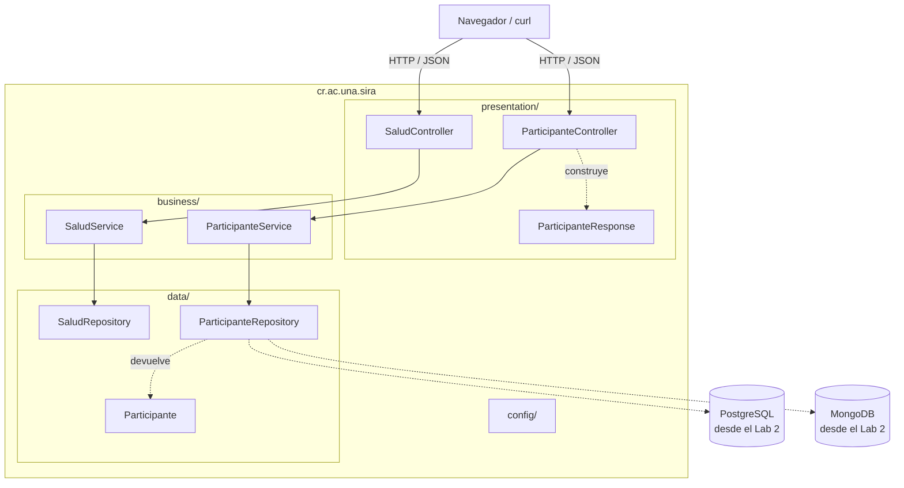
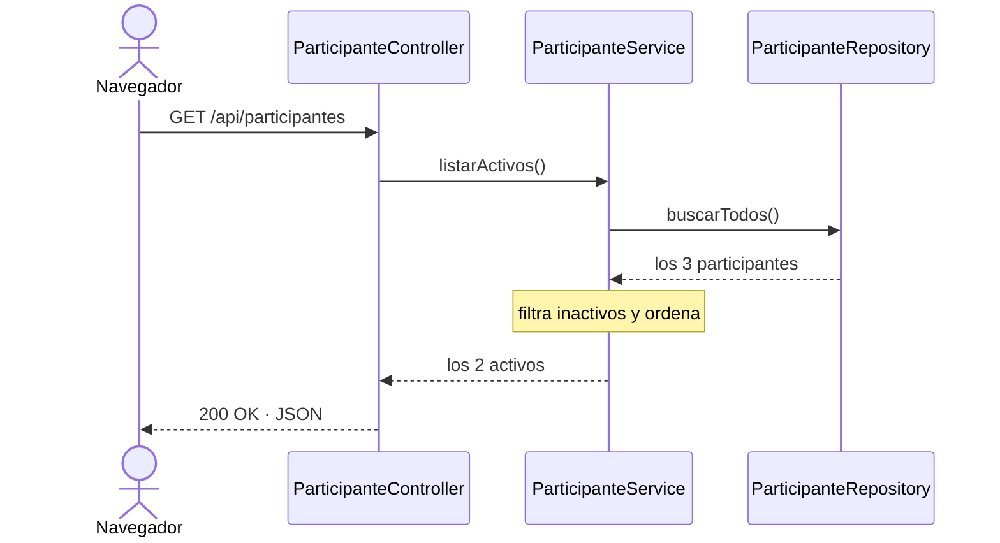

# Arquitectura de SIRA

El sistema está organizado en tres capas sobre Spring Boot 3. El porqué de esta organización está en el [ADR-001](adr/ADR-001-arquitectura-en-capas.md).

## Las capas



Las flechas continuas son dependencias reales en el código. Las punteadas todavía no existen.

| Capa | Paquete | Responsabilidad |
|------|---------|-----------------|
| Presentación | `presentation/` | Recibir HTTP y devolver JSON. Sin reglas de negocio. |
| Negocio | `business/` | Reglas, validaciones, cálculos y límites de transacción. |
| Datos | `data/` | Leer y guardar en la fuente de datos. |
| Configuración | `config/` | Beans de Spring. No es una capa del flujo, es transversal. |

## La regla de las dependencias

```
presentation  ->  business  ->  data
```

En una sola dirección. Un controlador puede llamar a un servicio, pero un servicio nunca debe saber que existe HTTP. Se puede comprobar buscando los imports: en `data/` no aparece nada de `business` ni de `presentation`, en `business/` no aparece nada de `presentation`, y `org.springframework.web` no aparece fuera de `presentation/`.

## Cómo interactúan

`GET /api/participantes`:



El repositorio devuelve tres y la API responde dos. El filtro está en el servicio y no en el repositorio porque "solo se asignan rutinas a participantes activos" es una regla de negocio, no un detalle de almacenamiento.

## Estructura

```
src/main/java/cr/ac/una/sira/
├── SiraApplication.java
├── presentation/   SaludController, ParticipanteController, ParticipanteResponse
├── business/       SaludService, ParticipanteService
├── data/           SaludRepository, ParticipanteRepository, Participante
└── config/         (vacío en el Lab 1)

src/test/java/cr/ac/una/sira/
├── SiraApplicationTests.java
└── business/ParticipanteServiceTest.java
```
