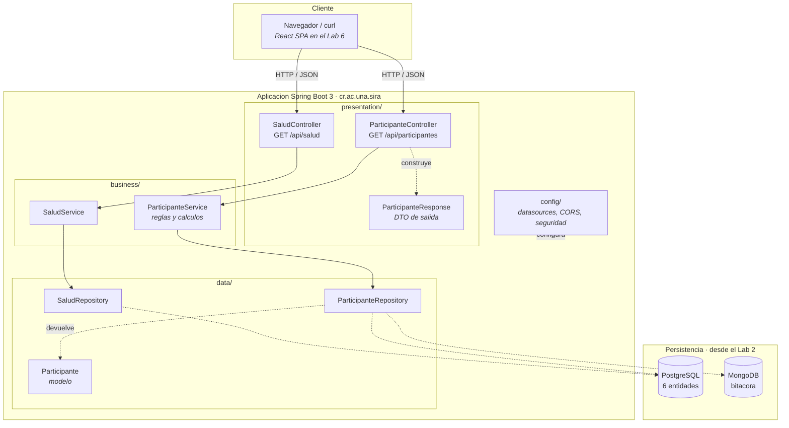
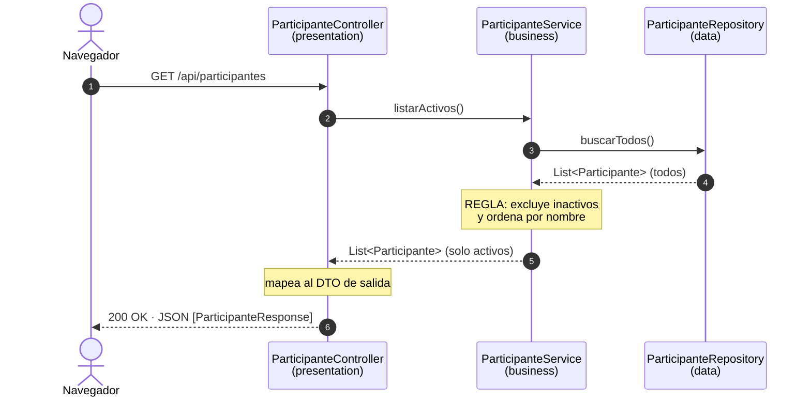

# Arquitectura de SIRA

Laboratorio 1. El sistema está organizado en capas técnicas sobre Spring Boot 3. La justificación de por qué elegí esta organización y qué descarté está en el [ADR-001](adr/ADR-001-arquitectura-en-capas.md).

## Las capas y cómo se comunican



Las flechas continuas son dependencias reales en el código, o sea un tipo que importa a otro. Las punteadas son relaciones de datos o infraestructura que todavía no existen en este laboratorio.

## La regla de las dependencias

```
presentation  ->  business  ->  data
```

En una sola dirección. Cada capa conoce únicamente a la que tiene debajo: un controlador puede llamar a un servicio, pero un servicio nunca debe saber que existe una pantalla, una petición HTTP o un navegador. Un repositorio no conoce ni al servicio ni al controlador.

Esto no es una promesa, se puede verificar buscando los `import` de cada paquete:

```bash
grep -r "import cr.ac.una.sira.\(business\|presentation\)" src/main/java/cr/ac/una/sira/data/
grep -r "import cr.ac.una.sira.presentation" src/main/java/cr/ac/una/sira/business/
grep -rl "org.springframework.web" src/main/java/cr/ac/una/sira/ | grep -v "/presentation/"
```

Las tres devuelven cero resultados. La tercera es la más fuerte de las tres, porque prueba que ninguna clase fuera de `presentation/` importa nada del paquete web de Spring: el negocio y los datos literalmente no pueden enterarse de que existe HTTP.

## Qué hace cada capa

| Capa | Paquete | Responsabilidad | Qué NO le toca |
|------|---------|-----------------|----------------|
| Presentación | `presentation/` | Recibir HTTP, validar el formato de la petición, serializar la respuesta | Reglas de negocio, cálculos, acceso a datos |
| Negocio | `business/` | Reglas, validaciones, cálculos, límites de transacción | Saber que existe HTTP; saber de dónde salen los datos |
| Datos | `data/` | Leer y escribir en la fuente de datos, modelo persistente | Decidir qué datos son válidos o cómo se calculan |
| Configuración | `config/` | Beans de Spring, datasources, CORS, seguridad | No es una capa del flujo, es transversal |

Vale aclarar que la arquitectura tiene **tres** capas, no cuatro. `config/` es un paquete, no una capa: nadie pasa por configuración camino a los datos.

## Recorrido de una petición

Tomando `GET /api/participantes` como ejemplo:



El repositorio devuelve tres participantes y la API responde dos. Esa diferencia está probada en `ParticipanteServiceTest` y es la evidencia de que la capa de negocio hace un trabajo propio en vez de ser un pasamanos.

El filtro de inactivos está en el servicio a propósito. Podría estar en el repositorio, como un `WHERE activo = true`, o en el controlador. Lo puse en el servicio porque "solo se asignan rutinas a participantes activos" es una decisión del negocio, no un detalle de almacenamiento ni de presentación. Si mañana cambiara a "activos o dados de alta hace menos de 30 días", cambia en un solo lugar.

## Estructura de carpetas

```
sira/
├── .github/workflows/ci.yml          Integración continua
├── build.gradle                      Spring Boot 3.3.13 · Java 21 · Gradle
├── docs/
│   ├── propuesta-dominio.md          6 entidades, 2 procesos
│   ├── arquitectura.md               este documento
│   └── adr/
│       └── ADR-001-arquitectura-en-capas.md
└── src/
    ├── main/java/cr/ac/una/sira/
    │   ├── SiraApplication.java      Punto de arranque
    │   ├── presentation/             Controladores y DTOs
    │   ├── business/                 Servicios
    │   ├── data/                     Repositorios y modelo
    │   └── config/                   Configuración transversal
    ├── main/resources/application.properties
    └── test/java/cr/ac/una/sira/
        ├── SiraApplicationTests.java              el contexto levanta
        └── business/ParticipanteServiceTest.java  la regla se cumple
```

## Cómo va a crecer

| Lab | Qué se agrega | Dónde cae |
|-----|---------------|-----------|
| 2 | PostgreSQL (6 entidades JPA) + MongoDB (bitácora) | `data/`, `config/` |
| 3 | API REST completa de rutinas y ejecuciones | `presentation/`, `business/` |
| 4 | Cierre transaccional de la ejecución diaria | `business/`, con `@Transactional` |
| 5 | Seguridad con roles `PROFESIONAL` / `ENCARGADO` | `config/`, `presentation/` |
| 6 | Frontend SPA en React | Proyecto aparte, consume esta API |

Ninguno de esos pasos obliga a mover las capas de sitio, y esa es la razón de definir la estructura desde el Laboratorio 1.
