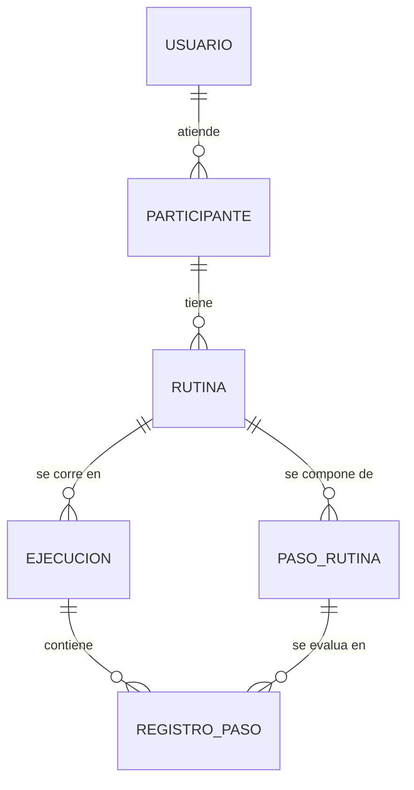

# Propuesta de Dominio - SIRA

EIF509 Desarrollo de Aplicaciones Basadas en Web · NRC 51092 · Grupo G01 · II Ciclo 2026

## 1. Identificación

- **Integrante:** Anthony Cerdas Chacón, carné 402410478 (trabajo individual)
- **Sistema:** SIRA, Sistema de Rutinas y Apoyos
- **Repositorio:** https://github.com/cerdasanthony/sira-eif509

## 2. El negocio

Un centro pequeño de terapia ocupacional y apoyo educativo en Alajuela atiende a personas autistas y a sus familias. Su trabajo gira en torno a rutinas estructuradas: secuencias de pasos como levantarse, la higiene o preparar la mochila, que dan predictibilidad y bajan la ansiedad de la persona. Hoy las arman en cartulinas con pictogramas y velcro.

El problema es el seguimiento. Entre la sesión en el centro y la casa se pierde: la mamá llega a la siguiente cita y cuenta de memoria que "esta semana le costó bañarse", pero no hay registro de cuántos días fueron, en qué paso se trabó, ni si hay avance respecto al mes pasado. SIRA digitaliza ese ciclo: el profesional diseña la rutina por pasos, el encargado registra en casa cómo salió cada paso, y el sistema calcula la adherencia en el tiempo.

SIRA es una herramienta de apoyo organizativo, no clínico. "Adherencia" se refiere a cuántos pasos de una rutina se completaron, no a un juicio sobre la persona.

### Actores

- **Profesional** (terapeuta o educador): diseña rutinas, las asigna, las publica y revisa el progreso. Rol `PROFESIONAL` en el Lab 5.
- **Encargado** (familiar o cuidador): ve la rutina del día y registra cómo salió cada paso. Rol `ENCARGADO`.

Los modelé como una sola entidad `Usuario` con un campo `rol`, porque comparten los mismos datos y solo cambia lo que pueden hacer. El participante no es usuario: es el sujeto del registro, no inicia sesión ni ejecuta acciones.

## 3. Entidades de negocio

| # | Entidad | Para qué sirve | Datos principales |
|---|---------|----------------|-------------------|
| 1 | Usuario | Quien opera el sistema | `nombre`, `correo`, `rol` (PROFESIONAL / ENCARGADO), `activo` |
| 2 | Participante | La persona que sigue las rutinas | `nombre`, `fechaNacimiento`, `activo` |
| 3 | Rutina | Secuencia asignada a un participante | `nombre`, `horaInicio`, `diasSemana`, `vigenciaDesde`, `vigenciaHasta`, `estado` (BORRADOR / PUBLICADA) |
| 4 | PasoRutina | Cada paso de una rutina | `orden`, `descripcion`, `duracionEstimadaMin` |
| 5 | Ejecucion | Un día concreto en que se corrió la rutina | `fecha`, `horaInicio`, `horaFin`, `adherencia` |
| 6 | RegistroPaso | Cómo salió un paso en esa ejecución | `resultado` (LOGRADO / CON_APOYO / NO_LOGRADO) |

### Relaciones

Seis relaciones, todas uno a muchos:

- Un Usuario atiende muchos Participantes.
- Un Participante tiene muchas Rutinas.
- Una Rutina se compone de muchos PasoRutina.
- Una Rutina se corre en muchas Ejecuciones.
- Una Ejecucion contiene muchos RegistroPaso.
- Un PasoRutina se evalúa en muchos RegistroPaso.



`Rutina` y `PasoRutina` son la plantilla, lo que debería pasar. `Ejecucion` y `RegistroPaso` son lo que realmente pasó ese día. Al inicio pensé en una sola tabla con una columna del tipo "¿se logró?", pero así el resultado de hoy sobrescribe el de ayer y se pierde el historial, que es justamente lo que hace falta para medir progreso.

### Subdominio documental candidato

La bitácora de observaciones. Por cada ejecución, el encargado o el profesional puede escribir notas libres ("hoy estaba muy irritable", "le funcionó el pictograma nuevo") con etiquetas y estructura variable según quién escriba. En tablas quedarían columnas llenas de NULL y una tabla aparte solo para las etiquetas. Lo voy a implementar en MongoDB en el Lab 2.

## 4. Procesos de negocio

### Proceso 1: publicar una rutina

El profesional arma la rutina en estado `BORRADOR`, le agrega los pasos en orden y la publica. Publicarla la deja disponible para registrar ejecuciones y congela sus pasos, porque si se pudieran editar después, los registros de ejecuciones anteriores quedarían apuntando a pasos que ya cambiaron.

**Reglas**

- Solo un usuario con rol `PROFESIONAL` puede publicar.
- Una rutina publicada no admite modificar, agregar ni eliminar pasos.
- El participante debe estar activo.

**Cálculo**

- `duracionTotal` = suma de la `duracionEstimadaMin` de todos los pasos.

**Validaciones**

- Al menos 2 pasos, con `orden` consecutivo desde 1 y sin huecos.
- `vigenciaDesde` no puede ser posterior a `vigenciaHasta`.
- No puede haber otra rutina publicada del mismo participante que se traslape en el mismo día de la semana y la misma franja horaria.

### Proceso 2: cerrar la ejecución diaria (transaccional)

Al final del día el encargado marca el resultado de cada paso y cierra la ejecución. Este es el proceso que voy a implementar como transacción en el Lab 4, porque hace tres escrituras que dependen entre sí: se crea la `Ejecucion`, se insertan los N `RegistroPaso` (uno por paso) y se calcula y guarda la adherencia.

Si se cayera a la mitad, quedaría una ejecución incompleta con una adherencia calculada sobre datos parciales. Ese dato no da error y se lee como un mal día del participante cuando en realidad fue un fallo técnico, así que las tres escrituras van juntas o no va ninguna.

**Reglas**

- La rutina debe estar en estado `PUBLICADA`.
- No se puede cerrar dos veces la misma rutina en la misma fecha.

**Cálculo**

Cada resultado vale un puntaje: `LOGRADO` = 1, `CON_APOYO` = 0.5, `NO_LOGRADO` = 0.

```
adherencia = (suma de puntos / cantidad de pasos) * 100
```

En una rutina de 4 pasos con LOGRADO, LOGRADO, CON_APOYO y NO_LOGRADO: `(1 + 1 + 0.5 + 0) / 4 * 100 = 62.5 %`.

**Validaciones**

- La fecha no puede ser futura.
- La fecha tiene que caer dentro de la vigencia de la rutina.
- La fecha tiene que caer en un día de la semana que la rutina incluya.
- Tienen que venir exactamente todos los pasos de la rutina, cada uno con su resultado.

### Otros procesos

El dominio tiene más procesos que iré detallando en los siguientes laboratorios: consultar la adherencia en un rango de fechas, registrar una observación en la bitácora, dar de baja a un participante y cerrar la vigencia de una rutina.

## 5. Alcance

**Dentro:** gestión de usuarios y participantes; diseño de rutinas con sus pasos; publicación de rutinas; registro y cierre de la ejecución diaria; consulta de adherencia por rango de fechas; bitácora de observaciones; roles `PROFESIONAL` y `ENCARGADO`; frontend React sobre la API.

**Fuera:** pagos y facturación; expediente clínico, diagnósticos o cualquier dato médico; app móvil nativa; notificaciones push o correos; almacenamiento de pictogramas y multimedia; reportes en PDF o Excel; múltiples sedes.

La exclusión del expediente clínico no es por tiempo. Es una decisión sobre qué debe ser este sistema.
