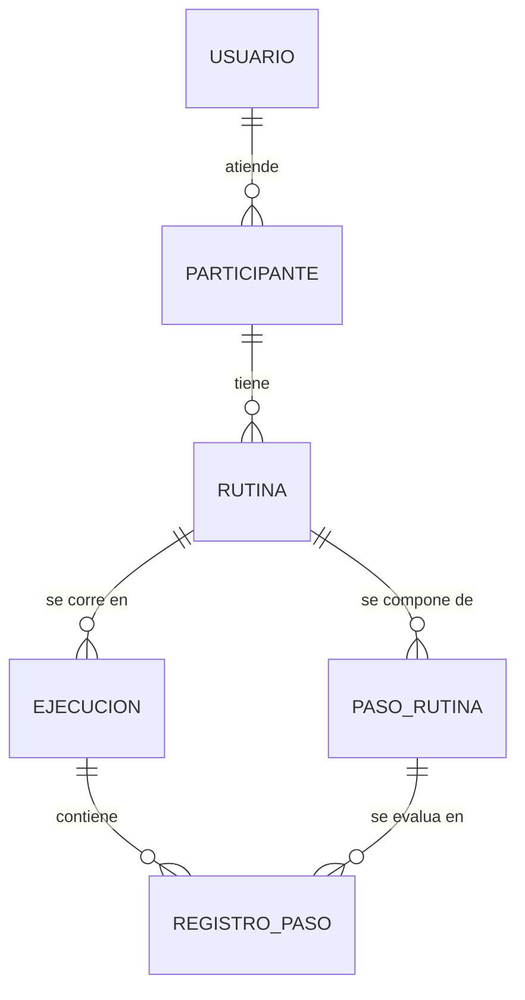

# Propuesta de Dominio - SIRA

**Laboratorio 1 · EIF509 Desarrollo de Aplicaciones Basadas en Web · NRC 51092 · Grupo G01 · II Ciclo 2026**

## 1. Identificación

**Integrante:** Anthony Cerdas Chacón, carné 402410478
**Modalidad:** individual (sin pareja asignada)
**Sistema propuesto:** SIRA, Sistema de Rutinas y Apoyos
**Repositorio:** https://github.com/cerdasanthony/sira-eif509

## 2. El negocio

### Descripción

Un centro pequeño de terapia ocupacional y apoyo educativo en Alajuela atiende a personas autistas y a sus familias. Buena parte de su trabajo diario gira en torno a rutinas estructuradas: secuencias de pasos como levantarse, la higiene de la mañana, preparar la mochila o las transiciones entre actividades. Esas rutinas dan predictibilidad y bajan la ansiedad de la persona.

Hoy las arman en cartulinas plastificadas con pictogramas pegados con velcro. Armarlas no es el problema. El problema es que el seguimiento se pierde entre la sesión en el centro y la casa: la mamá llega a la siguiente cita y cuenta de memoria que "esta semana le costó bañarse", pero nadie sabe cuántos días fueron, en qué paso exactamente se trabó, ni si comparado con el mes pasado hay avance.

SIRA digitaliza ese ciclo. El profesional diseña la rutina por pasos y se la asigna a un participante. En la casa, el encargado registra día a día cómo salió cada paso. El sistema calcula la adherencia en el tiempo, y así la siguiente sesión se decide viendo datos en vez de recuerdos.

Una precisión que me parece importante dejar escrita desde el inicio: SIRA es una herramienta de apoyo organizativo, no clínico. Ayuda a sostener rutinas y autonomía; no diagnostica ni evalúa a nadie. Cuando hablo de "adherencia" me refiero a cuántos pasos de una rutina se completaron, nunca a un juicio sobre la persona. Por eso el expediente clínico quedó explícitamente fuera del alcance, y no por falta de tiempo.

### Actores

**Profesional.** Es la terapeuta ocupacional o el educador del centro. Necesita diseñar rutinas, asignarlas a participantes, publicarlas y revisar el progreso. Será el rol `PROFESIONAL` en el Laboratorio 5.

**Encargado.** Es el familiar o cuidador. Necesita ver la rutina del día y registrar en casa cómo salió cada paso. Será el rol `ENCARGADO`.

Los modelé como una sola entidad `Usuario` con un campo `rol`, no como dos entidades separadas. Comparten exactamente los mismos datos y lo único que los distingue es qué pueden hacer; dos tablas casi idénticas me habrían duplicado el esquema sin ganar nada, y además complicarían el login porque habría que buscar en dos lados.

El participante no es un usuario del sistema. Es el sujeto del registro: no tiene contraseña, no inicia sesión y no ejecuta acciones. Por eso `Participante` quedó como entidad aparte y no aparece como rol de acceso.

## 3. Entidades de negocio

| # | Entidad | Para qué sirve | Datos principales |
|---|---------|----------------|-------------------|
| 1 | Usuario | Quien opera el sistema | `nombre`, `correo`, `rol` (PROFESIONAL / ENCARGADO), `activo` |
| 2 | Participante | La persona que sigue las rutinas | `nombre`, `fechaNacimiento`, `activo` |
| 3 | Rutina | Una secuencia asignada a un participante | `nombre`, `horaInicio`, `diasSemana`, `vigenciaDesde`, `vigenciaHasta`, `estado` (BORRADOR / PUBLICADA) |
| 4 | PasoRutina | Cada paso dentro de una rutina | `orden`, `descripcion`, `duracionEstimadaMin` |
| 5 | Ejecucion | Un día concreto en que se corrió la rutina | `fecha`, `horaInicio`, `horaFin`, `adherencia` |
| 6 | RegistroPaso | Cómo salió un paso en esa ejecución | `resultado` (LOGRADO / CON_APOYO / NO_LOGRADO) |

Dos campos son enumeraciones y no texto libre: el estado de la rutina y el resultado del paso. Lo hice así para que nadie termine escribiendo "logrado", "Logrado" y "LOGRADO" y aparezcan tres categorías donde debería haber una. Además, sin valores cerrados el cálculo de adherencia no sería posible, porque cada resultado tiene un puntaje asociado.

### Relaciones

Son seis, todas uno a muchos. Ninguna necesita tabla intermedia.

- Un Usuario atiende muchos Participantes.
- Un Participante tiene muchas Rutinas.
- Una Rutina se compone de muchos PasoRutina.
- Una Rutina se corre en muchas Ejecuciones.
- Una Ejecucion contiene muchos RegistroPaso.
- Un PasoRutina se evalúa en muchos RegistroPaso.



`RegistroPaso` tiene dos padres: la ejecución en la que ocurrió y el paso al que corresponde. Esa doble referencia es la que después permite preguntar en qué paso concreto falla más un participante durante el último mes, cruzando las dos dimensiones.

### La decisión que más me costó: separar la plantilla del hecho

`Rutina` y `PasoRutina` son la plantilla, o sea lo que debería pasar. `Ejecucion` y `RegistroPaso` son el hecho: lo que realmente pasó ese día.

Mi primera idea fue más simple, una sola tabla donde cada paso tuviera una columna del tipo "¿se logró?". Cuando la revisé me di cuenta de que se rompía por tres lados. Marcar el resultado sobre el paso significa sobrescribir el de ayer, así que solo existiría el último día y desaparecería el historial. Sin historial no hay progreso que medir, que es justamente para lo que existe el sistema. Y editar la rutina para el futuro corrompería los registros del pasado, porque quedarían apuntando a pasos que ya no son los que se ejecutaron.

Separarlas me costó dos entidades más y consultas más largas. A cambio, el sistema puede responder que en marzo la adherencia promedio fue 68% y en abril 81%.

La analogía que me sirvió para tenerlo claro: es la diferencia entre una receta y las veces que cocinaste ese plato. La receta es una sola y no cambia porque un día se te haya quemado.

### Subdominio documental candidato

La bitácora de observaciones. Por cada ejecución, el encargado o el profesional puede escribir notas libres del tipo "hoy estaba muy irritable" o "le funcionó el pictograma nuevo", con etiquetas y con una estructura que cambia según quién escriba.

Esto en tablas quedaría mal: columnas llenas de NULL para los campos que a veces están y a veces no, una tabla aparte para las etiquetas porque son de largo variable, y algún tipo de tabla clave-valor incómoda de consultar para el resto. Un documento JSON absorbe esa variabilidad sin esquema fijo, así que lo voy a implementar en MongoDB en el Laboratorio 2.

No uso Mongo para todo el sistema porque el resto del dominio es lo contrario: seis entidades con estructura fija, relaciones estrictas y una operación que necesita transacciones sobre varias tablas. Ahí un motor relacional encaja mejor.

## 4. Procesos de negocio

### Proceso 1: publicar una rutina

El profesional arma la rutina en estado `BORRADOR`, le agrega los pasos en orden, y cuando está lista la publica. Publicarla la deja disponible para registrar ejecuciones y congela sus pasos.

El flujo es: crear la rutina para un participante en borrador, agregarle los pasos con su orden, descripción y duración estimada, y pedir la publicación. En ese momento el sistema valida todo, calcula la duración total y la pasa a `PUBLICADA`.

**Reglas**

- Solo un usuario con rol `PROFESIONAL` puede publicar.
- Una rutina publicada no admite modificar, agregar ni eliminar pasos.
- El participante destinatario debe estar activo.

**Cálculo**

`duracionTotal` es la suma de la `duracionEstimadaMin` de todos los pasos.

**Validaciones**

- La rutina debe tener al menos 2 pasos, con `orden` consecutivo desde 1 y sin huecos. Una rutina de un solo paso no es una secuencia, y un hueco (1, 2, 4) casi siempre significa que algo se borró mal.
- `vigenciaDesde` no puede ser posterior a `vigenciaHasta`.
- No puede haber otra rutina publicada del mismo participante que se traslape en el mismo día de la semana y la misma franja horaria. Una persona no puede estar en dos rutinas a la vez.

Lo de congelar los pasos al publicar sale directo de la separación entre plantilla y hecho. Si se pudiera editar una rutina ya publicada, los `RegistroPaso` de ejecuciones anteriores quedarían apuntando a pasos que cambiaron de descripción o de orden, y el historial mentiría. Congelar es la forma barata de garantizar que lo que se registró siga significando lo mismo dentro de seis meses. La alternativa sería versionar la rutina, que es más flexible pero bastante más compleja, y la dejé fuera.

### Proceso 2: cerrar la ejecución diaria

Este es el proceso transaccional, el que voy a implementar como transacción en el Laboratorio 4.

Al final del día el encargado abre la rutina del día, marca el resultado de cada paso (`LOGRADO`, `CON_APOYO` o `NO_LOGRADO`) y cierra la ejecución. Ahí el sistema valida, calcula la adherencia y guarda todo de una sola vez.

**Por qué tiene que ser transaccional**

Cerrar la ejecución hace tres escrituras que dependen entre sí:

1. Se crea la `Ejecucion` con su fecha y horas.
2. Se insertan los N `RegistroPaso`, uno por cada paso de la rutina.
3. Se calcula la adherencia y se actualiza sobre la `Ejecucion`.

Supongamos que se cae la conexión justo después de insertar el registro 4 de 6. Sin transacción quedaría en la base una ejecución con solo cuatro registros y una adherencia calculada sobre datos parciales. Ese dato no da error ni se ve raro: el profesional lo lee como un mal día del participante cuando en realidad fue un fallo técnico. Un dato falso que parece bueno es peor que no tener el dato. Por eso las tres escrituras van dentro de la misma transacción, y si algo falla la base queda como si nunca se hubiera intentado.

**Reglas**

- La rutina debe estar en estado `PUBLICADA`.
- No se puede cerrar dos veces la misma rutina en la misma fecha.

**Cálculo de la adherencia**

Cada resultado vale un puntaje: `LOGRADO` = 1, `CON_APOYO` = 0.5, `NO_LOGRADO` = 0.

```
adherencia = (suma de puntos / cantidad de pasos) * 100
```

Por ejemplo, en una rutina de 4 pasos con resultados LOGRADO, LOGRADO, CON_APOYO y NO_LOGRADO:

```
suma = 1 + 1 + 0.5 + 0 = 2.5
adherencia = (2.5 / 4) * 100 = 62.5 %
```

El 0.5 de `CON_APOYO` no es arbitrario. Hacer algo con ayuda es un resultado intermedio real, no un fracaso, y un sistema de logrado/no logrado perdería justamente la información más útil para el profesional, que es dónde la persona está a mitad de camino.

**Validaciones**

- La fecha no puede ser futura.
- La fecha tiene que caer dentro de la vigencia de la rutina.
- La fecha tiene que caer en un día de la semana que la rutina incluya. Si la rutina es de lunes a viernes, no se puede cerrar un domingo.
- Tienen que venir exactamente todos los pasos de la rutina, cada uno con su resultado. Ni pasos de menos, ni pasos que no pertenecen a esa rutina.

### Otros procesos identificados

Estos dos son los que desarrollé a fondo, pero el dominio tiene más. Los dejo apuntados acá para irlos detallando conforme avancen los laboratorios:

- **Consultar adherencia en un rango de fechas.** Tiene cálculo propio, porque hay que promediar las ejecuciones del rango y separar el resultado por paso para ver dónde se traba la persona.
- **Registrar una observación en la bitácora.** Es el que conecta con MongoDB y el que tiene la estructura más libre.
- **Dar de baja a un participante.** La parte interesante es decidir qué pasa con sus rutinas publicadas y con el historial ya registrado, que no se debería borrar.
- **Cerrar la vigencia de una rutina.** Completa el ciclo de vida, que hoy solo llega hasta publicarla.

## 5. Alcance

### Dentro

- Gestión de usuarios y de participantes.
- Diseño de rutinas con sus pasos ordenados.
- Publicación de rutinas con sus reglas y validaciones.
- Registro y cierre de la ejecución diaria, como operación transaccional.
- Consulta de adherencia por rutina en un rango de fechas.
- Bitácora de observaciones por ejecución, en MongoDB.
- Autenticación y autorización por rol `PROFESIONAL` / `ENCARGADO`.
- Frontend SPA en React sobre la API REST.

### Fuera

- Pagos, facturación y facturación electrónica ante Hacienda.
- Expediente clínico: diagnósticos, medicación o cualquier dato médico.
- App móvil nativa. El frontend web responsivo cubre el uso en la casa.
- Notificaciones push o envío de correos.
- Almacenamiento de pictogramas, fotos o cualquier multimedia.
- Reportes exportables a PDF o Excel.
- Múltiples sedes u organizaciones. El sistema atiende a un solo centro.

Definir el "fuera" desde el inicio me sirve para no dispersarme y para dejar claro contra qué se evalúa el proyecto. De todas formas hay una diferencia entre esas exclusiones: casi todas podrían agregarse algún día si sobrara tiempo, pero la del expediente clínico no. Esa es una decisión sobre qué debe ser este sistema.
