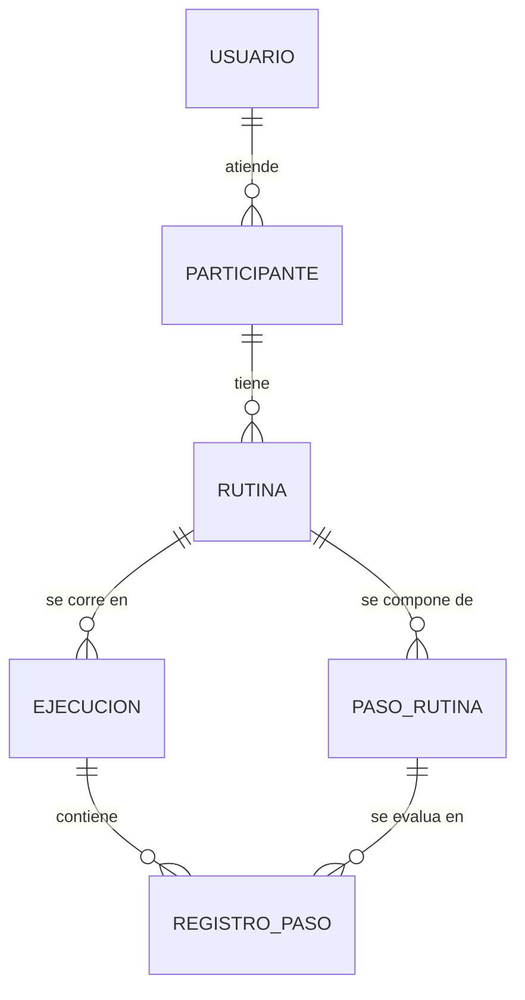

# Propuesta de Dominio · SIRA

**Laboratorio 1 — EIF509 Desarrollo de Aplicaciones Basadas en Web · NRC 51092 · Grupo G01 · II Ciclo 2026**

---

## 1 · Identificación

**Integrante:** Anthony Cerdas Chacón — carné 402410478
**Modalidad:** trabajo individual (sin pareja asignada).
**Sistema propuesto:** **SIRA — Sistema de Rutinas y Apoyos**
**Repositorio:** https://github.com/cerdasanthony/sira-eif509

---

## 2 · El negocio

### Descripción del negocio

Un centro pequeño de terapia ocupacional y apoyo educativo en Alajuela atiende a personas autistas y a
sus familias. Su trabajo diario gira en torno a **rutinas estructuradas**: secuencias de pasos
(levantarse, higiene, preparar la mochila, transiciones entre actividades) que dan predictibilidad y
reducen la ansiedad de la persona. Hoy esas rutinas se arman en cartulinas plastificadas con
pictogramas pegados con velcro, y el seguimiento de cómo le fue a cada persona se pierde entre la
sesión en el centro y la casa: la mamá cuenta de memoria *"esta semana le costó bañarse"*, pero no hay
registro de cuántos días, en qué pasos, ni si hay mejora.

SIRA digitaliza ese ciclo. El profesional diseña rutinas por pasos y se las asigna a cada participante;
en casa, el encargado registra día a día cómo salió cada paso; y el sistema calcula la **adherencia** a
lo largo del tiempo, para que en la siguiente sesión se decida con datos y no con recuerdos.

> **Nota sobre el dominio.** SIRA es una herramienta de apoyo **organizativo**, no clínico. El sistema
> ayuda a sostener rutinas y autonomía; no etiqueta, no diagnostica y no evalúa clínicamente a nadie.
> El término *adherencia* describe el seguimiento de una rutina, no un juicio sobre la persona.

### Actores

| Actor | Quién es | Qué necesita del sistema | Rol de acceso (Lab 5) |
|---|---|---|---|
| **Profesional** | Terapeuta ocupacional o educador del centro | Diseñar rutinas por pasos, asignarlas a participantes, publicarlas y revisar el progreso a lo largo del tiempo | `PROFESIONAL` |
| **Encargado** | Familiar o cuidador de la persona participante | Ver la rutina del día y registrar en casa cómo salió cada paso, cerrando la ejecución diaria | `ENCARGADO` |

Ambos actores se modelan como una sola entidad `Usuario` con un campo `rol`, para no inflar el diseño
con dos tablas casi idénticas.

El **participante** (la persona que sigue las rutinas) *no* es un usuario del sistema: es el sujeto del
registro, no un operador. Por eso `Participante` es una entidad aparte y no un rol de acceso.

---

## 3 · Entidades de negocio

### Listado de entidades (6)

| # | Entidad | Para qué sirve en el negocio | Datos principales |
|---|---|---|---|
| 1 | **Usuario** | Quien opera el sistema: el profesional que diseña y el encargado que registra | `nombre`, `correo`, `rol` (PROFESIONAL / ENCARGADO), `activo` |
| 2 | **Participante** | La persona que sigue las rutinas de apoyo | `nombre`, `fechaNacimiento`, `activo` |
| 3 | **Rutina** | Una secuencia de apoyo asignada a un participante concreto | `nombre`, `horaInicio`, `diasSemana`, `vigenciaDesde`, `vigenciaHasta`, `estado` (BORRADOR / PUBLICADA) |
| 4 | **PasoRutina** | Cada paso individual dentro de una rutina | `orden`, `descripcion`, `duracionEstimadaMin` |
| 5 | **Ejecucion** | Un día concreto en que se corrió una rutina | `fecha`, `horaInicio`, `horaFin`, `adherencia` (%) |
| 6 | **RegistroPaso** | Cómo salió un paso específico en esa ejecución | `resultado` (LOGRADO / CON_APOYO / NO_LOGRADO) |

### Relaciones

Las seis relaciones son **uno-a-muchos**; el modelo no requiere tablas intermedias.

- Un **Usuario** atiende muchos **Participantes**.
- Un **Participante** tiene muchas **Rutinas**.
- Una **Rutina** tiene muchos **PasoRutina**.
- Una **Rutina** tiene muchas **Ejecuciones**.
- Una **Ejecucion** tiene muchos **RegistroPaso**.
- Un **PasoRutina** tiene muchos **RegistroPaso** (uno por cada día en que se ejecutó ese paso).

### La decisión de diseño que hace esto no trivial

**`Rutina` + `PasoRutina` son la plantilla** (lo que *debería* pasar).
**`Ejecucion` + `RegistroPaso` son el hecho** (lo que *realmente* pasó ese día).

Separar ambas cosas es lo que permite tener historial y medir progreso. Si se colapsaran en una sola
tabla —marcando el resultado directamente sobre el paso— se perdería la capacidad de comparar día
contra día, y publicar una rutina nueva borraría la historia anterior.

### Subdominio documental candidato (MongoDB, Lab 2)

**Bitácora de observaciones.** Por cada ejecución, el encargado o el profesional puede escribir notas
libres: *"hoy estaba muy irritable"*, *"le funcionó el pictograma nuevo"*, con etiquetas y estructura
variable según quién escribe y qué quiera anotar.

Es información tipo documento, sin esquema fijo: campos que aparecen o no, listas de etiquetas de
longitud variable, texto libre. Modelarla en tablas obligaría a columnas nulas o a una tabla
clave-valor incómoda de consultar. Encaja natural en MongoDB.

En el Laboratorio 1 solo se identifica; se implementa en el Laboratorio 2.

---

## 4 · Procesos de negocio

### Proceso 1 · Publicar una rutina

El profesional arma una rutina en estado `BORRADOR`, le agrega los pasos en orden, y cuando está lista
la **publica**. Publicar la deja disponible para registrar ejecuciones y congela sus pasos.

**Paso a paso**

1. El profesional crea la rutina para un participante, en estado `BORRADOR`.
2. Agrega los pasos con su orden, descripción y duración estimada.
3. Solicita la publicación.
4. El sistema valida la rutina completa; si pasa, calcula su duración total y la deja en `PUBLICADA`.

**Reglas**

- Solo un usuario con rol `PROFESIONAL` puede publicar una rutina.
- Una rutina `PUBLICADA` no admite modificar, agregar ni eliminar sus pasos.
- El participante destinatario debe estar activo.

**Cálculos**

- `duracionTotal` = suma de `duracionEstimadaMin` de todos los pasos de la rutina.

**Validaciones**

- La rutina debe tener **al menos 2 pasos**, con `orden` consecutivo desde 1 y sin huecos.
- `vigenciaDesde` no puede ser posterior a `vigenciaHasta`.
- No puede existir otra rutina `PUBLICADA` del mismo participante que se traslape en el mismo día de
  la semana y en la misma franja horaria.

---

### Proceso 2 · Cerrar la ejecución diaria  *(transaccional — Lab 4)*

Al final del día, el encargado registra cómo salió cada paso de la rutina y **cierra la ejecución**.
Este es el proceso que en el Laboratorio 4 se implementa como transacción.

**Paso a paso**

1. El encargado abre la rutina del día para un participante.
2. Marca el resultado de cada paso: `LOGRADO`, `CON_APOYO` o `NO_LOGRADO`.
3. Cierra la ejecución.
4. El sistema valida, calcula la adherencia y persiste todo de una sola vez.

**Por qué debe ser transaccional**

Cerrar la ejecución produce **varias escrituras que tienen que ocurrir todas juntas o ninguna**:

1. se inserta la `Ejecucion` (fecha, hora de inicio y fin);
2. se insertan los **N** `RegistroPaso`, uno por cada paso de la rutina;
3. se calcula la adherencia y se actualiza sobre la `Ejecucion`.

Si algo falla a la mitad —por ejemplo, se cae la conexión al insertar el registro 4 de 6— quedaría en
la base una ejecución incompleta con una adherencia calculada sobre datos parciales. Ese dato sería
*silenciosamente falso*: el profesional lo leería como un mal día del participante, cuando en realidad
fue un fallo técnico. Por eso las tres escrituras van dentro de una misma transacción.

**Reglas**

- La rutina debe estar en estado `PUBLICADA`.
- No se puede cerrar dos veces la misma rutina en la misma fecha.

**Cálculos**

- Puntaje por paso: `LOGRADO` = 1 · `CON_APOYO` = 0.5 · `NO_LOGRADO` = 0.
- `adherencia = (suma de puntos ÷ cantidad de pasos) × 100`

  *Ejemplo:* rutina de 4 pasos con resultados `LOGRADO`, `LOGRADO`, `CON_APOYO`, `NO_LOGRADO`
  → `(1 + 1 + 0.5 + 0) ÷ 4 × 100 = 62.5 %`

**Validaciones**

- La `fecha` de la ejecución no puede ser futura.
- La `fecha` debe caer dentro de la vigencia de la rutina (`vigenciaDesde` … `vigenciaHasta`).
- La `fecha` debe caer en un día de la semana que la rutina incluya.
- Deben venir **exactamente todos** los pasos de la rutina, cada uno con su resultado: ni pasos de
  menos, ni pasos que no pertenecen a esa rutina.

---

## 5 · Alcance

### Dentro del alcance

- Gestión de usuarios (profesional / encargado) y de participantes.
- Diseño de rutinas con sus pasos ordenados.
- Publicación de rutinas, con sus reglas y validaciones (Proceso 1).
- Registro y cierre de la ejecución diaria como operación transaccional (Proceso 2).
- Consulta de adherencia por rutina en un rango de fechas.
- Bitácora de observaciones por ejecución, en MongoDB.
- Autenticación y autorización por rol `PROFESIONAL` / `ENCARGADO`.
- Frontend SPA en React sobre la API REST.

### Fuera del alcance

- **Pagos y facturación** de cualquier tipo, y facturación electrónica ante Hacienda.
- **Expediente clínico**: diagnósticos, medicación o cualquier dato médico. SIRA es apoyo
  organizativo, no clínico — este límite es de fondo, no de tiempo.
- App móvil nativa (el frontend web responsivo cubre el uso en casa).
- Notificaciones push o envío de correos.
- Almacenamiento de pictogramas, fotos o cualquier multimedia.
- Reportes exportables a PDF o Excel.
- Múltiples sedes u organizaciones (el sistema atiende a un solo centro).

---

*EIF509 Desarrollo de Aplicaciones Basadas en Web · Prof. Elberth Adrián Garro Sánchez · II Ciclo 2026*
